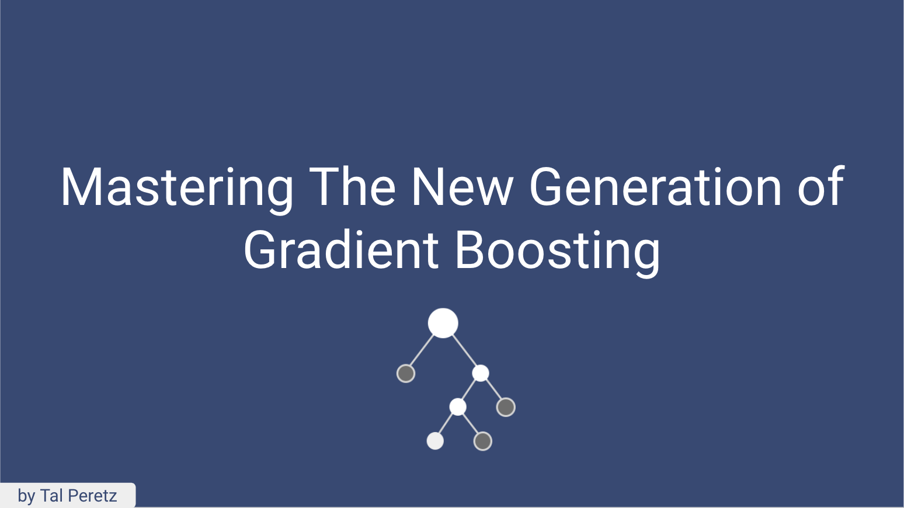
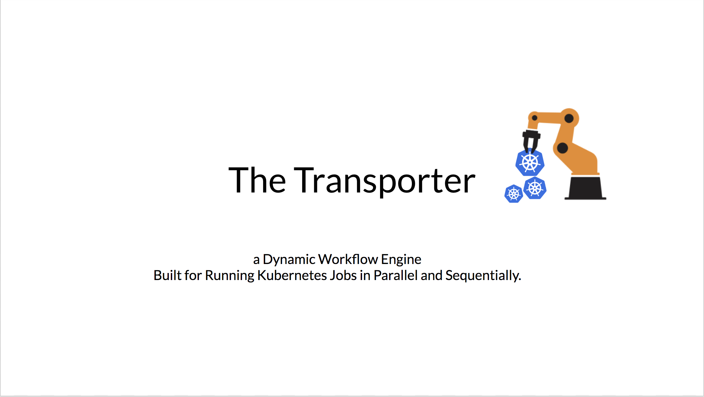

## Biography

Tal Peretz is a Data Scientist, Software Engineer, and a Continuous Learner.   
You may know him as DataHack 2018 1st prize winner (with his brother).  
Previously, he founded and lead the Israeli Air Force Data Science team.  
Nowadays he is leveraging ML to fight fraud at simplex.com.   
Tal also writes for KDnuggets, Towards Data Science and HackerNoon.  

You can reach him at talperetz.com  

## Publications
[Mastering The New Generation of Gradient Boosting](https://towardsdatascience.com/https-medium-com-talperetz24-mastering-the-new-generation-of-gradient-boosting-db04062a7ea2) 
[Visualize Your Data with Google Data Studio](https://towardsdatascience.com/visualize-your-data-with-google-data-studio-609c38247905) 
[Scaling Effectively: when Kubernetes met Celery](https://hackernoon.com/https-medium-com-talperetz24-scaling-effectively-when-kubernetes-met-celery-e6abd7ce4fed) 
[Deep Politics - First Step Towards an AI Takeover](https://medium.com/@talperetz24/deep-politics-first-step-towards-an-ai-takeover-236074c7c2d7) 

## Talks
 
 
 
 

## Contact:

icons by [Axialis](https://www.iconfinder.com/WillE)