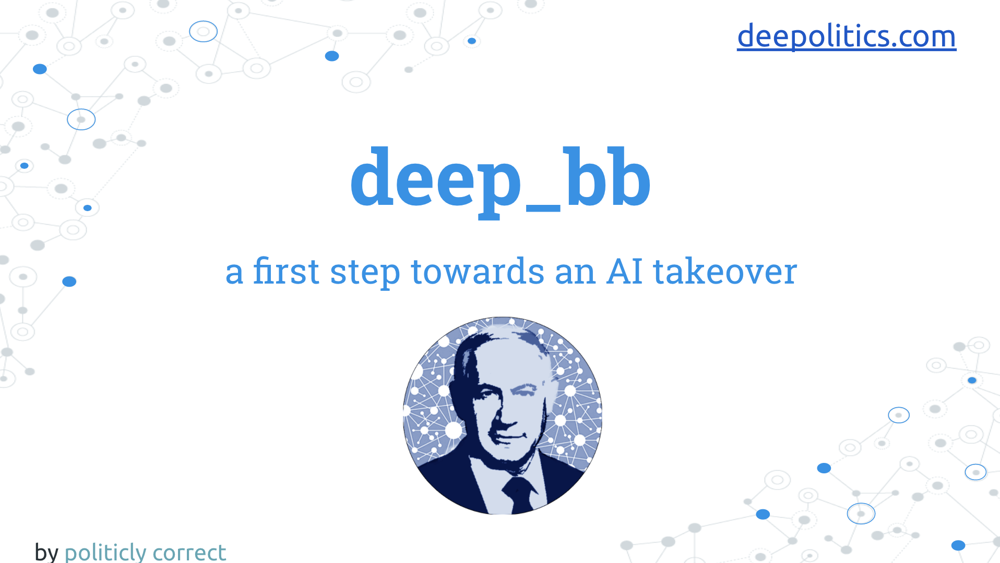

# Diary of a Data Scientist

## Target Audience

***Data Scientists*** and ***Data Enthusiasts*** with theoretical and limited practical experience.

## Abstract

While I'm sure you have solved complex Data Science and ML projects, whether in your academical courses, Kaggle or other online resources, I bet no one ever talked to you about the workflow. How to initiate a data science project? How to deliver your model as a product? What to do when you encounter an unfamiliar problem?
 
This talk goal is to **bridge the gap between the academy/army and the industry**.

## Agenda

- Outline the **Data Science workflow**.
- **Dilemmas and Complications** while implementing Data driven solutions (explained using a real project).

## Preview Slides

## Session duration

About 50 min

## Awesome Links

[Why applied ML is hard?](https://machinelearningmastery.com/applied-machine-learning-is-hard/) 
[First step towards an AI takeover](https://medium.com/@talperetz24/deep-politics-first-step-towards-an-ai-takeover-236074c7c2d7) 
[The Unreasonable Effectiveness of Recurrent Neural Networks](http://karpathy.github.io/2015/05/21/rnn-effectiveness/) 