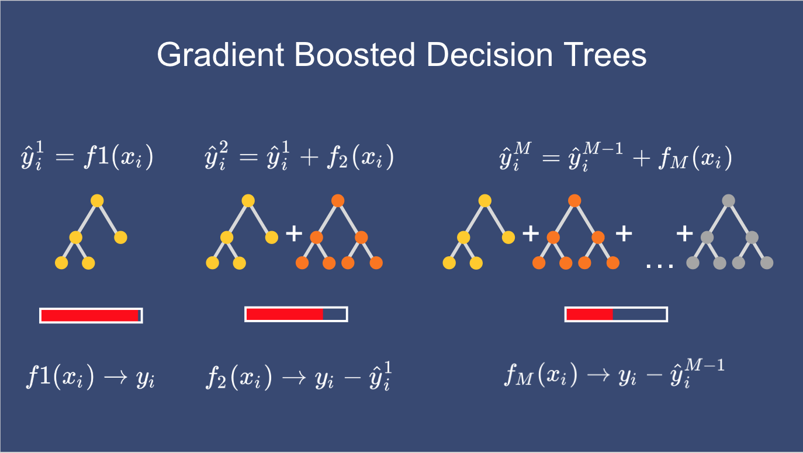
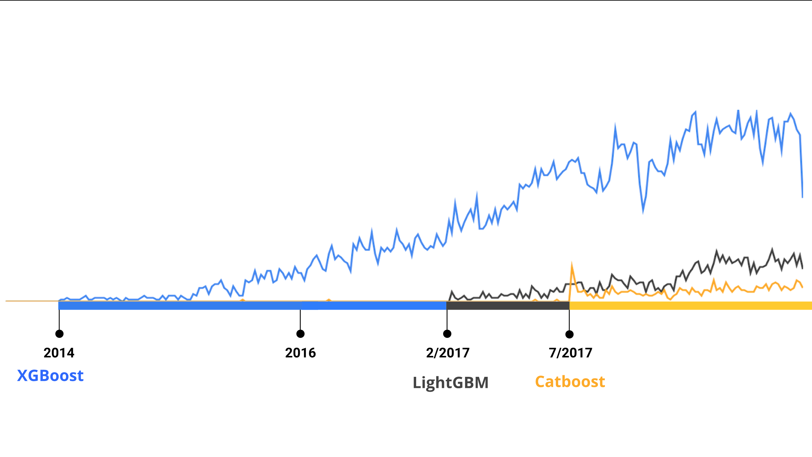
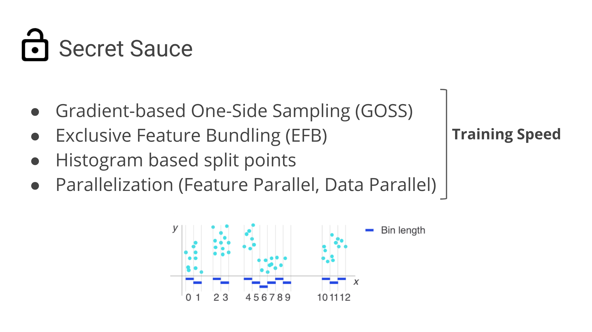
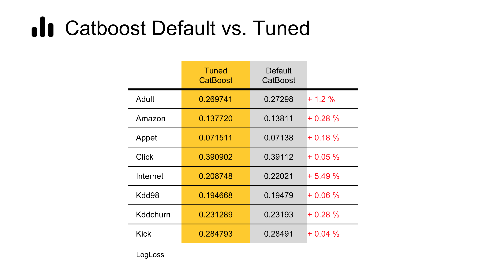

# Mastering The New Generation of Gradient Boosting

## Target Audience

***Data Scientists***.

## Abstract

Gradient Boosted Decision Trees are the hottest ML models for tabular data.  
These models have already taken over Kaggle and are now taking over the industry.  
In this talk, we are going to explore and compare XGBoost, LightGBM & the cool kid on the block - Catboost.  

## Agenda

- Intro
- Boosting
- GBDTs + Tweaks
- XGBoost vs. LightGBM vs. Catboost
- Takeaway

## Preview Slides

## Session duration

About 60 min

## Awesome Links

[GBDTs Hyperparameters Spaces](https://github.com/talperetz/hyperspace/tree/master/GBDTs) 
[Awesome Gradient Boosting](https://github.com/talperetz/awesome-gradient-boosting/) 
