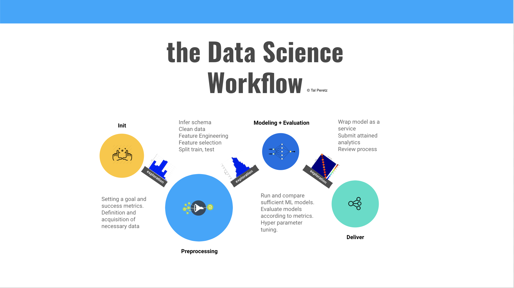
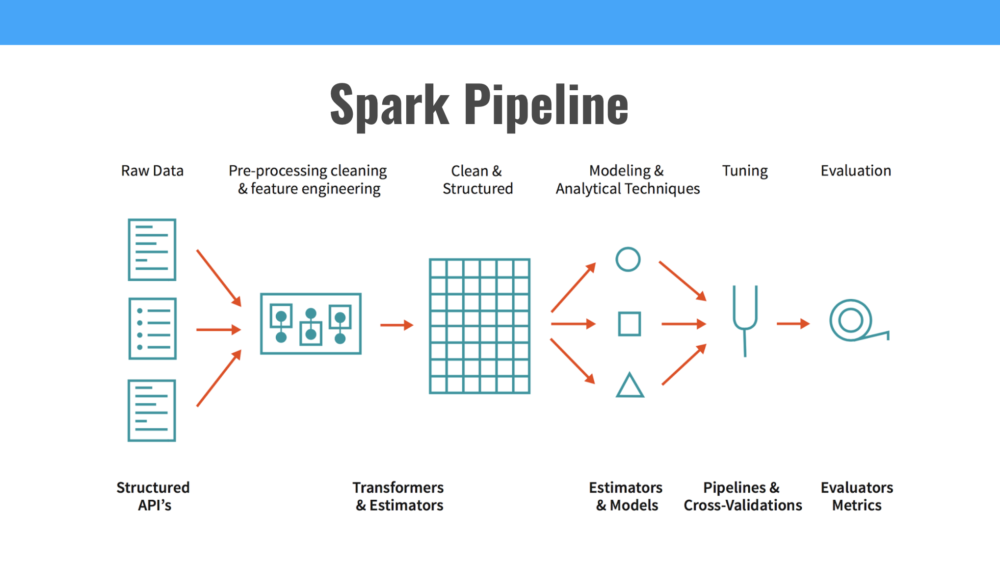

# Spark for Data Scientists

## Target Audience

***Data scientists*** and ***ML software engineers*** with experience in local data science frameworks (such as sklearn, pandas ,seaborn) yet no extensive experience with spark.

## Abstract

While most of the data scientists are capable of handling python or R frameworks to solve Data Science and ML problems, we bump into some mental obstacles before solving problems using Spark. This talk goal is to **bring spark down to earth**.

## Agenda

- Outline the **Data Science workflow**.
- Understand Spark’s place in the **Data Science ecosystem**.
- Apply the Data Science workflow using **Spark hands-on** (while comparing to local frameworks).

## Preview Slides

## Session duration

About 50 min

## Awesome Links

[Pyspark Installation](https://github.com/zipfian/spark-install) 
[Pyspark Documentation](https://spark.apache.org/docs/2.2.0/api/python/index.html) 
[Data Scientists guide to Spark](http://go.databricks.com/hubfs/Landing_pages/DS%20Guide%20to%20Spark/Data-Scientists-Guide-to-Apache-Spark.pdf?t=1514418267665) 
[Dask vs. Spark](https://stackoverflow.com/questions/38882660/at-what-situation-i-can-use-dask-instead-of-apache-spark) 
[Big Data Frameworks Compared](https://www.digitalocean.com/community/tutorials/hadoop-storm-samza-spark-and-flink-big-data-frameworks-compared) 
[Spark.ML vs Mllib](https://www.quora.com/Why-are-there-two-ML-implementations-in-Spark-ML-and-MLlib-and-what-are-their-different-features) 
