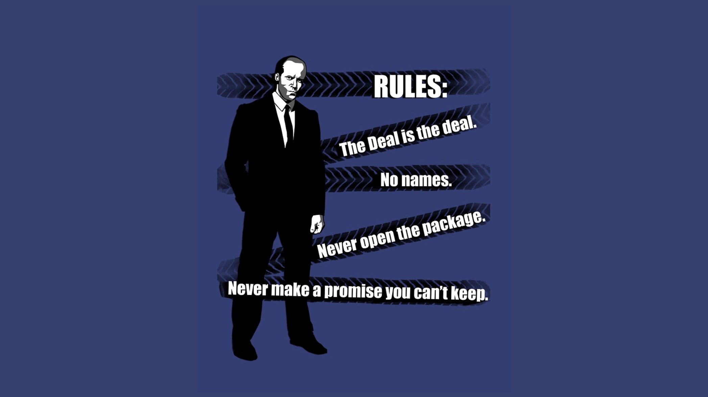
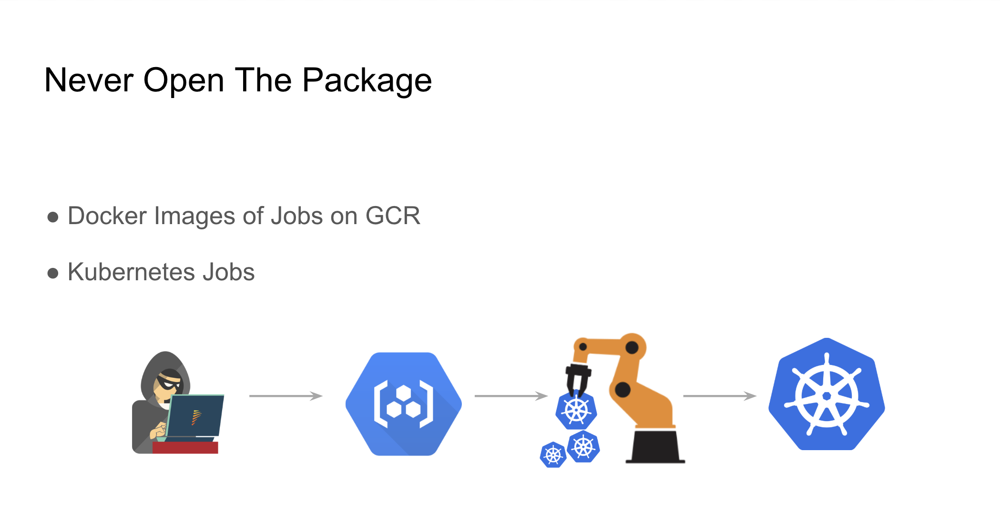
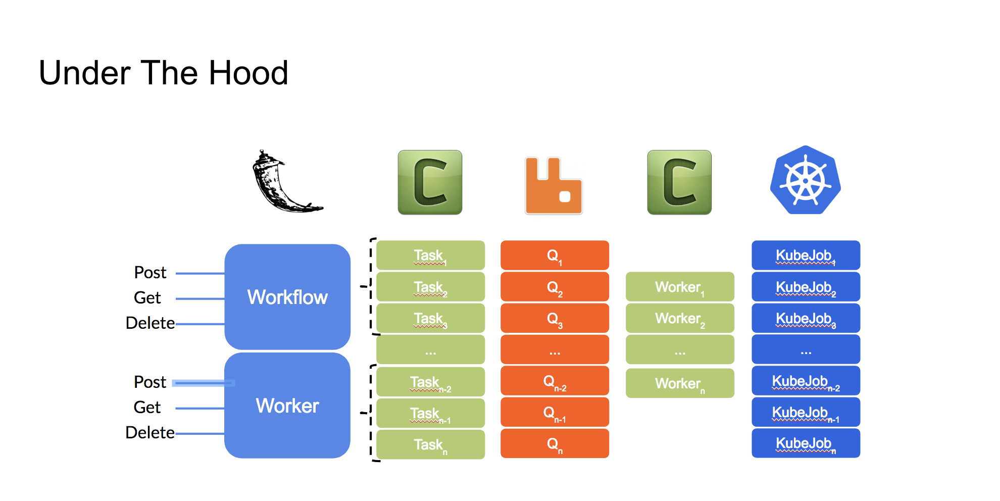

# The Transporter - A Dynamic Workflow Engine

## Target Audience

***Software Engineers*** and ***Devops*** who want to manage batch job or background tasks in an easy async way.

## Abstract

Talk about the transition from manually triggered bash scripts to a fully automated, flexible and scalable architecture that leverage Kubernetes and distibuted task queues (Celery).

## Agenda

- Our Problems at Panorays
- Solution
- The Rules
- Under The Hood
- Demo
- What's Next

## Preview Slides

## Session duration

About 30 min

## Awesome Links

[Celery Documentation](http://docs.celeryproject.org/en/latest/index.html) 
[Celery Configuration Params](http://docs.celeryproject.org/en/latest/userguide/configuration.html) 
[Celery Management Console Tutorial](https://developers.coveo.com/display/public/SitecoreV3/Accessing+the+RabbitMQ+Management+Console;jsessionid=EC3825EEC11DADC9DE3F3D3DE4A2C142) 
[Bitnami Rabbitmq VM Tutorial](https://console.cloud.google.com/compute/instancesDetail/zones/europe-west1-b/instances/rabbitmq-2-vm?q=search&project=panorays-main&graph=GCE_CPU&duration=PT1H) 
